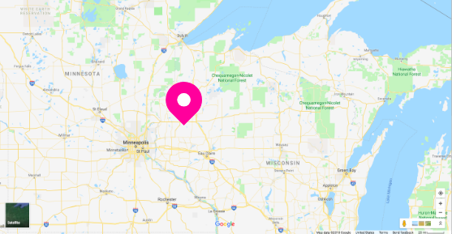

# entertin

Entertin, WI, USA is a digital paper town, a collection of websites that create a presence online for a city that doesn't exist. 

*entertin location, roughly*

## context

The original goal of the project was to build a fake-city generator, one that would spoof some navigational technologies we rely on to illustrate the weak points of web integrity and our own excessive trust in online vetting and web maps. Broadly, this could also play into the original purpose of paper towns, to protect the IP of creators; where Entertin is replicated, we illustrate the faults in our systems of sourcing and verifying.

What does it mean to be so ignorant of distant geographies that potentially mythical ones are completely plausible? What does it mean when a fake physical place is reinforced by our trust in digital service providers and social media?

**"entertin"** is the working title of the project, and the hyper-alpha prototype of a fake city; it's also an anagram for **"internet."**

## what is a paper town?

In old-school print cartography, "paper towns" were fake locations on a map meant to sign the print, so if replicated illegally, that plagiarism could be identified through the existence of a fake location. With web-maps, we often trust that these incongruences or slips have been corrected, though [that's not always the case](http://bigthink.com/strange-maps/643-agloe-the-paper-town-stronger-than-fiction).

> Fictitious entries may be used to demonstrate copying, but to prove legal infringement, the material must also be shown to be eligible for copyright (see Feist v. Rural, Fred Worth lawsuit or Nester's Map & Guide Corp. v. Hagstrom Map Co., 796 F.Supp. 729, E.D.N.Y., 1992.)

~ Wikipedia, _[Ficticious Entry](https://en.wikipedia.org/wiki/Fictitious_entry)_

## what's up with this project?

This project was meant as a test, to see if creating a web presence might automagically lead to points on online maps. There are lots of political, legal, and ethical issues with propogating fake places on the web, so I kept the project prototypical to avoid polluting our shared maps and perspective on the world with more fake news.

There's a smattering of thoughts, edge case ideas and unfinished quixotic dreams in the [issues queue](https://github.com/auremoser/entertin/issues). For now, the project is a collection of four simple websites (submoduled in this repo) and live online, which create a web-crawlable fake town.

* WWEN Radio Station: http://wwen.info/
* Local Band: http://www.isps.club
* Municipal City Center: http://entertin.city/
* Public Library: http://entertin.org/

There are oodles of easter eggs in the names, terms, and comments of the websites to indicate that they are fake, not to mention pages to nowhere, broken links, bad design...

## origin story

Entertin grew out of some great conversations with several friends, who I am indebted to for putting up with my crazy ideas. Principally, @blahah, @robbykraft, @dlublin, @joeyklee, @wooorm. They do cool stuff and you should check them out too.

It was also inspired by this [NPR piece on fake towns becomming real](https://www.npr.org/sections/krulwich/2014/03/18/290236647/an-imaginary-town-becomes-real-then-not-true-story), this [CityLab article on why equitable maps are more accurate and humane](https://www.citylab.com/equity/2018/03/who-maps-the-world/555272/), the [curious case of the shed at dulwich](https://en.wikipedia.org/wiki/The_Shed_at_Dulwich), [@metropology](https://twitter.com/metropologeny?lang=en) and all of Martin O'Leary's map-gen projects, and Megan Amram's [awesome pun place collection](https://twitter.com/meganamram/status/913642289834090497?lang=en).

